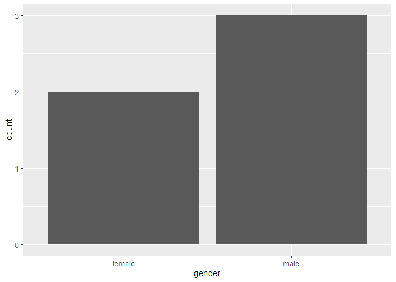

<!-- README.md is generated from README.Rmd. Please edit that file -->

# names.cze

<!-- badges: start -->

<!-- badges: end -->

So far, R package *names.cze* can only do one thing: estimate the gender
of people living in the Czech Republic from their names. This is a first
preview, a more robust solution and more features will come later.

## Installation

You can install the preview version from GitHub:

``` r
devtools::install_github("MarekProkop/names.cze")
```

## Examples

Guess the gender of a single name:

``` r
library(names.cze)
get_sex("Josef")
#> [1] "male"
get_sex("Nováková")
#> [1] "female"
```

The *get\_sex* function is vectorized:

``` r
get_sex(c("Jan", "Jana", "Petr", "Petra"))
#> [1] "male"   "female" "male"   "female"
```

Using with dplyr:

``` r
library(dplyr, quietly = TRUE)
#> 
#> Attaching package: 'dplyr'
#> The following objects are masked from 'package:stats':
#> 
#>     filter, lag
#> The following objects are masked from 'package:base':
#> 
#>     intersect, setdiff, setequal, union
df <- tibble(
  name = c("Jan", "Jitka", "Soňa", "Michal", "Radovan")
)
df %>% 
  mutate(sex = get_sex(name))
#> # A tibble: 5 x 2
#>   name    sex   
#>   <chr>   <chr> 
#> 1 Jan     male  
#> 2 Jitka   female
#> 3 Soňa    female
#> 4 Michal  male  
#> 5 Radovan male
```

Using with ggplot2:

``` r
library(ggplot2, quietly = TRUE)
df %>% 
  ggplot(aes(get_sex(name))) +
  geom_bar() +
  labs(x = "gender")
```



Without additional parameters, the *get\_sex* function returns the
gender that is more common among name bearers in the Czech Republic. If
you want more certainty, use the threshold parameter, which is a number
from 0 to 1 indicating the minimum probability. If the actual
probability does not exceed this value (or at least does not equal it),
the function returns NA.

``` r
get_sex("Rut")
#> [1] "female"
get_sex("Rut", threshold = 0.9)
#> [1] NA
```

If you have both first and last names stored in one variable, the
*get\_sex* function will not work because it only works with one-word
names for now. In this case, send only the first name to the function,
as this generally has a better predictive value. For example, you can
use the *word* function from the *stringr* package.

``` r
get_sex("Josef Novák")
#> [1] NA
library(stringr, quietly = TRUE)
get_sex(word("Josef Novák"))
#> [1] "male"
```

For debugging purposes, you can use the inspect\_name function. It is
not vectorized, so you can only pass one name to it.

``` r
inspect_name("Václav")
#> # A tibble: 1 x 5
#>   name   male_forename female_forename male_surname female_surname
#>   <chr>          <dbl>           <dbl>        <dbl>          <dbl>
#> 1 václav        137247               2          212              0
```
